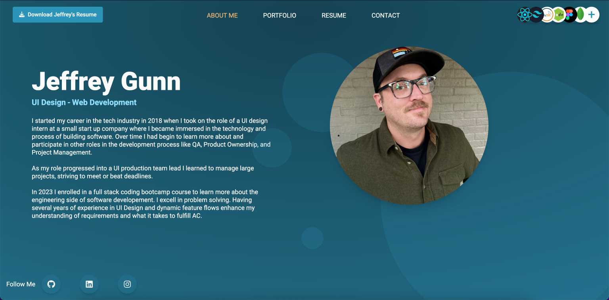

# my-portfolio

## Description

Welcome to my portfolio. My journey at the UCD Coding Bootcamp has been a long one but as I have been approaching the final weeks I have been challenged with building my own portfolio using React.js. This project has been a lot of fun and was a test of both my coding and design skills.

Viewers can see my Resume, portfolio of projects, contact me, and down load my resume.

## Table of Contents

- [Intallation](#installation)
- [Usage](#usage)
- [Credits](#credits)
- [License](#license)
- [Assets](#assets)

## Installation

`npm i` will run install on all dependencies
`npm run dev` will initiate Vite in dev mode.

## Usage

Usage of the application is not open source.

## Credits

- Jeffrey Gunn - Full front end development

## License

No license information for this application

## Assets

- [Live Application](https://jeffrey-gunn-ui-dev.netlify.app/)
- 
